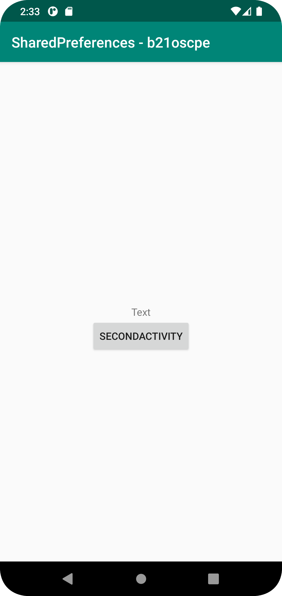
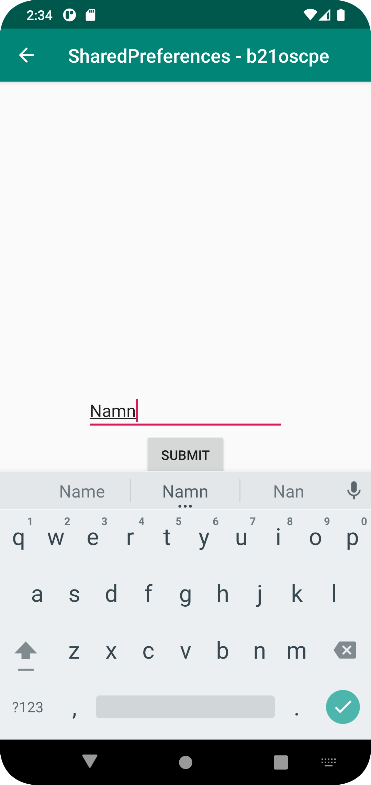

# Rapport

**Assignment 6: Preferences**

```
// Här är kod från min OnCreate()-funktion där vi använder oss av intents för att skicka användaren till nästa sida. 
        text_label = findViewById(R.id.text_label);

        preferences = getSharedPreferences("preferences", MODE_PRIVATE);

        button = findViewById(R.id.button);
        button.setOnClickListener(new View.OnClickListener() {

            @Override
            public void onClick(View view) {
                Log.d("==>", "Click registered");
                Intent intent = new Intent(MainActivity.this, SecondActivity.class);
                startActivity(intent);
            }
        });

// I vår OnResume()-funktion hämtar vi det som sparades i SecondActivity med preferences. Om ingenting hittades skriver vi ut "name cant be found".
protected void onResume() {
        Log.d("==>", "onResume");
        super.onResume();

        String name = preferences.getString("name", "name cant be found");
        text_label.setText(name);
        
// Här använder vi oss av en EditText och en "editor" för att spara det som användaren angett i strängformat. När användaren återgår till MainActivity kommer texten som de skrev dyka upp.
        edit_name = findViewById(R.id.editTextTextPersonName);
        preferences = getSharedPreferences("preferences", MODE_PRIVATE);

        button = findViewById(R.id.button);
        button.setOnClickListener(new View.OnClickListener() {
            @Override
            public void onClick(View view) {
                Log.d("==>", "Registered click");
                SharedPreferences.Editor editor = preferences.edit();
                editor.putString("name", edit_name.getText().toString());
                editor.apply();
            }
        });
    }
```






Läs gärna:

- Boulos, M.N.K., Warren, J., Gong, J. & Yue, P. (2010) Web GIS in practice VIII: HTML5 and the canvas element for interactive online mapping. International journal of health geographics 9, 14. Shin, Y. &
- Wunsche, B.C. (2013) A smartphone-based golf simulation exercise game for supporting arthritis patients. 2013 28th International Conference of Image and Vision Computing New Zealand (IVCNZ), IEEE, pp. 459–464.
- Wohlin, C., Runeson, P., Höst, M., Ohlsson, M.C., Regnell, B., Wesslén, A. (2012) Experimentation in Software Engineering, Berlin, Heidelberg: Springer Berlin Heidelberg.
